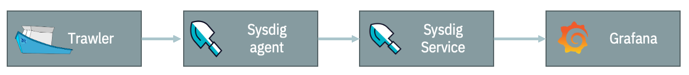

Even though a lot has changed within the API Connect product and the types and numbers of stacks we're running since I first posted an overview of [monitoring API Connect](/apic/monitoring/) , the main areas we  monitor haven't.  
<!--more-->
We are still using [Grafana](https://grafana.com) as a central location for dashboarding and analysing data across different data sources but some of the tools we're using to collect the data have changed. Having access to all the data in a single UI is really powerful, especially when troubleshooting or investigating events across the systems, being able to identify correlations between data from external load balancing, response times parsed from logs and pod utilisation metrics can really help narrrow in on specific components and how they impact the wider solution. 

## Metrics

For metrics we're making use of the IBM Cloud Monitoring with Sysdig to gather metrics from across the kubernetes deployment, including metrics from kubernetes itself and recognisable container applications such as nginx.  We also supplement this with our own custom metrics exporter, [Trawler](https://github.com/ibm/apiconnect-trawler),  which we built for API Connect to extract key application specific data and expose them to a prometheus compatible monitoring tool or send them to graphite. Examples of data gathererd are counts of objects within API Manager and DataPower and analytics call counts.  For endpoint and availability monitoring we are continuing to use [Hem](https://github.com/rickymoorhouse/hem) which is a simple python application to call HTTP(s) endpoints and send the metrics to our graphtie stack.   All of these then come together to view within our grafana dashboards - and to be used within new exploratory dashboards whilst problem solving as needed.

## Logging

For our logging infrastructure, we continue to use [Elastic](https://elastic.co/), making use of the filebeat agent within our clusters to gather and tag the container logs, then some custom parsing in logstash to parse out the significant elements from the different logs so that we can easily correlate these with events going on in the system.  A lot of the time this data is then viewed in timeseries graphs within grafana, but also linked to Kibana views to dig deeper in the logs themselves.  
