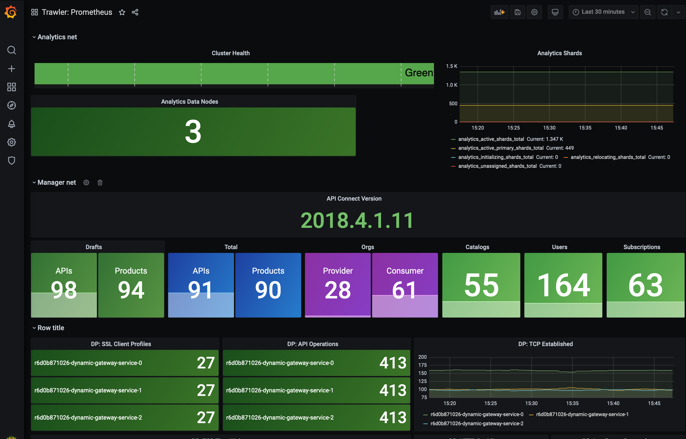

As part of our work in running and monitoring our API Connect cloud deployments we've built some of our own tooling to assist with monitoring what is going on within the deployments.  Trawler is one of these items which is used to gather metrics from a Kubernetes based deployment of API Connect. 

Trawler runs within kubernetes alongside API Connect and identifies the API Connect components and exposes metrics to prometheus (or other compatible monitoring tooling)

This data can then be used to feed into dashboards such as this one in Grafana:

Trawler is open-source and [available on github](https://github.com/ibm/apiconnect-trawler) and [docker hub](https://hub.docker.com/repository/docker/rickymoorhouse/trawler) - See the [installation guide](https://github.com/IBM/apiconnect-trawler/blob/main/docs/install.md) for more information on using trawler for yourself.

<!--more-->

The kind of metrics that trawler collects are currently as follows:

### Management subsystem:
 - API Connect version information (apiconnect_build_info)
 - Total users (apiconnect_users_total)
 - Number of provider_orgs (apiconnect_provider_orgs_total)
 - Number of consumer orgs (apiconnect_consumer_orgs_total)
 - Number of catalogs (apiconnect_catalogs_total)
 - Number of draft products / apis (apiconnect_draft_products_total / apiconnect_draft_apis_total)
 - Number of products / apis (apiconnect_products_total / apiconnect_apis_total)
 - Number of subscriptions (apiconnect_subscriptions_total)

### DataPower subsystem:
 - TCP connection stats (datapower_tcp...)
 - Log target stats: events processed, dropped, pending (datapower_logtarget...)
 - Object counts e.g. SSLClientProfile, APICollection, APIOperation etc. (datapower_{object}_total) 
 - HTTP Stats (datapower_http_tenSeconds/oneMinute/tenMinutes/oneDay)

### Analytics subsystem

 - Cluster health status (analytics_cluster_status)
 - Number of nodes in the cluster (analytics_data_nodes_total/analytics_nodes_total)
 - Number of shards in states - active, relocating, initialising, unassigned (analytics_{state}_shards_total)
 - Number of pending tasks (analytics_pending_tasks_total)
