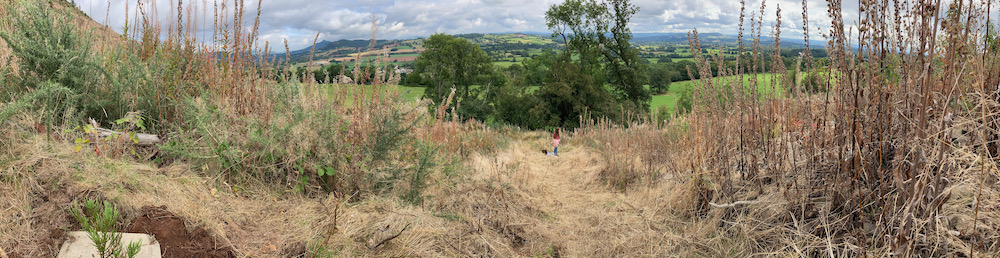

This weekend, to mark our 40th birthdays we planted Giant Sequoias with [One Life One Tree](https://onelifeonetree.com) at their planting site near Abergavenny. Sequoias are the world's largest growing tree species and capture up to 10x more carbon per hectare than a traditional woodland, so should capture the equivalent of a person's lifetime carbon footprint. 

The site in Abergavenny was previously a commercial woodland grown as a mono-culture so the projects involvement there will increase biodiversity on the site with the planting of Sequoias along with the additional native species they will be planting alongside them.  

<!--more -->
Laura got me my Sequoia for my birthday in May and we'd been looking forward to the planting opportunity since then.  On Saturday morning I surprised her with the news that I'd arranged for her to plant a tree too so we would both have Sequoias planted side by side.  

We walked up to the planting site from the town of Llanellen where they had reserved parking spaces at the town hall. The walk was a continual incline across fields and over the Monmouth and Brecon canal. Whilst the hill-side itself is very steep, fortunately we didn't need to go to far up to our spot for planting.

 
 

The site had been prepared with undergrowth clearance, paths and planting spots, so once we'd reached out planting spots we just needed to clear the clear the grass for the area our trees would be planted and dig the hole for the tree.
 
 
 

We then placed the trees in the ground, surrounded them with soil and patted them in firmly. 
 
 
 

Covered the surrounding area with a mulch mat which prevents other growth too close to the tree and keeps the moisture in. After a couple of years these and their fastenings will bio-degrade.

 
 
 

It's amazing to think how different this hillside will look in the future as the Sequoias and the native trees being planted alongside mature, a total of over 8 thousand trees, bringing quite a transformation from how it looks today. 

We had a really great time planting the trees and enjoying the surroundings in Wales - the planting experience was really well organised and it all seems thoroughly thought through to ensure the trees make a positive impact.  A great way to mark a milestone birthday!

