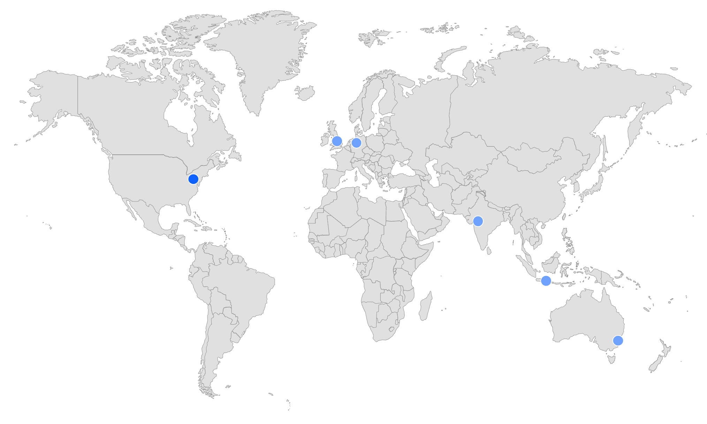
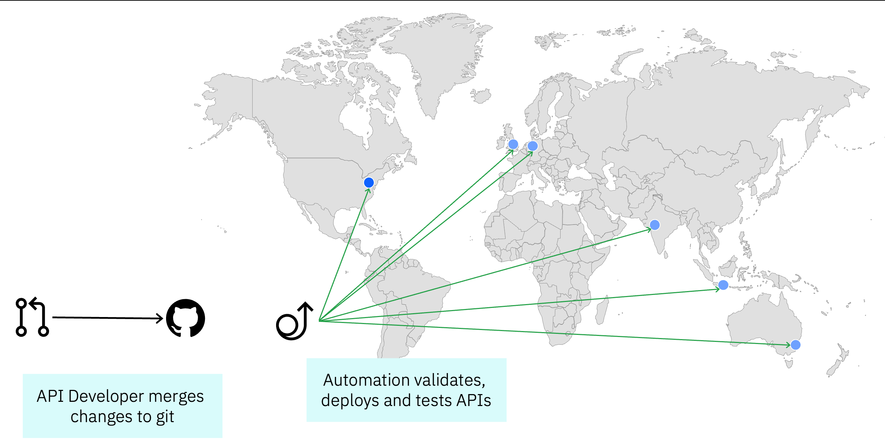
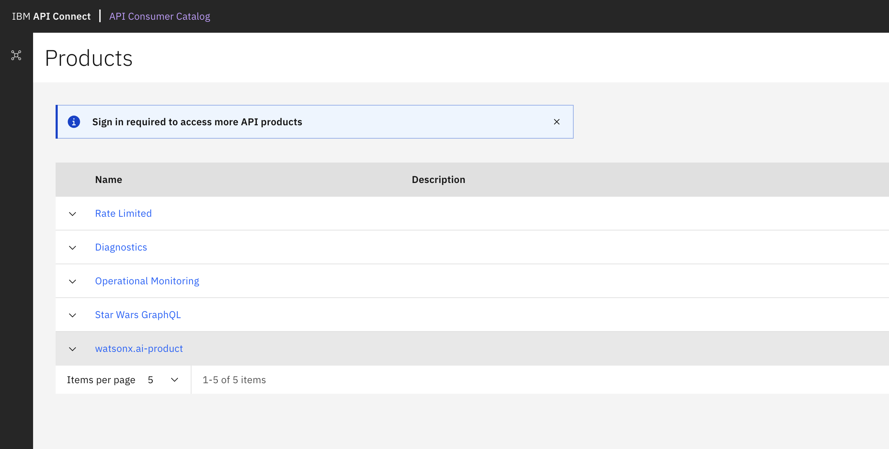
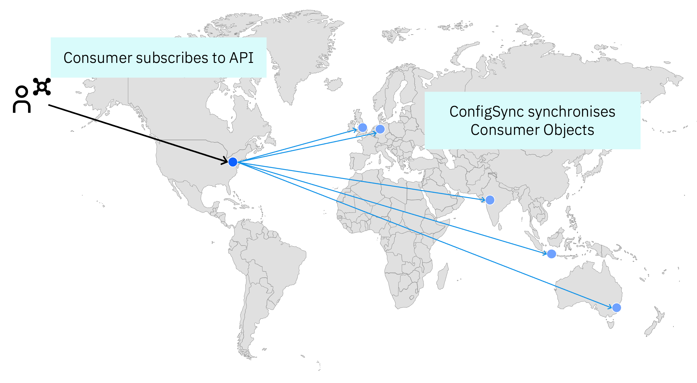

If you have customers around the world you might want to serve them from a global API Connect footprint such that they can call the API from a location closest to them. 

In this example I'm deploying my APIs to the 6 current regions of the API Connect Multi-tenant SaaS service on AWS. At the time of writing these are N. Virginia, Frankfurt, London, Sydney, Mumbai and Jakarta. I will use N. Virginia as the initial source location.

## Automatically Deploy APIs and Products to all locations

Create a pipeline that deploys APIs and products to all regions - you could base this around the [sample github action available](https://github.com/ibm-apiconnect/actions) or build it using the [example CLI scripts](https://github.com/ibm-apiconnect/devops). This then will enable me to 

## Create an API Connect instance in each region

Create an API Connect instance in each of the regions you want to deploy to. You can use the same image as your source location, but make sure to specify a different hostname for each instance. Each paid subscription for API Connect SaaS includes up to 3 instances which can be distributed as you wish across the available regions.

## Configure the portal for the source location

In my simple example I opted to use the new [Consumer Catalog](https://consumer-catalog.us-east-a.apiconnect.automation.ibm.com/ibm/production) as I don't need to configure any custom branding or anything like that. However I did enable approval flows for sign ups so that I can manage who has access to my APIs and products.

## Configure ConfigSync to push configuration changes to all regions

As config sync runs from a source to a target region, you need to run it for each target region in turn. In my case this is done with a loop through the hostnames and a lookup for the appropriate API Key to use for each region.

## Verify that everything works as expected

- In the source region, register a consumer org in the portal and subscribe to a product that contains an API to use.
- Use the "Try now" section to invoke the API
- Ensure the configsync job has had time to complete successfully for each region
- Call the same API across the other regions to validate that everything is working as expected.

## Possible next steps

- Configure global load balancing to route customers to the closest location automatically. 