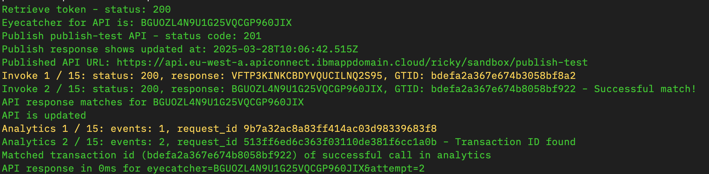

This script originated as part of a much wider framework of tests that we put together when I was in the API Connect SRE team. However I’ve found this set of functions to be something useful to be able to validate quickly from time to time in different contexts to give a high level answer to ‘Is it working?’

<!--more-->

The steps this script takes are as follows:

- Authenticate to the API Manager Platform API and retrieve an access token
- Take a templated API and Product and modify it to return a unique value
- Publish this API to a nominated catalog
- Invoke the API through the gateway (looping until a successful response is seen)
- Query the Analytics APIs to find the event logged for this invocation (again looping until found)

Whilst the entire test frameworks a lot of assumptions around how our environments are built and deployed, this test was relatively standalone - and I just needed to make a couple of updates to it to work outside of our cloud deployments - add support to turn off certificate validation and for username/password instead of API Key based authentication.  Take a look at the script on GitHub.

If you want to try this in your own environment you can follow these steps:

1. Clone the repository

    ```bash
    git clone https://github.com/ibm-apiconnect/quick-check.git
    ```

3. Install the python required dependencies

    ```bash
    pip install -r requirements.txt
    ```

3. Identify the appropriate credentials to use for your stack - either username/password or an api-key if you are using an OIDC registry and set these as environment variables (APIC_API_KEY or APIC_REALM, APIC_USERNAME & APIC_PASSWORD) or use the command line parameters - either of:

   - `-u <apim_user> -p <apim_password> -r provider/default-idp-2` (Local user registry or LDAP)
   - `-a <apim_api_key>` (OIDC e.g. SaaS)

4. Download the credentials.json file from the toolkit download page to identify the client id and client secret for your environment - these can either be set as environment variables (CLIENT_ID / CLIENT_SECRET) or as command line parameters (--client_id / --client_secret)

5. Run the script according to the usage examples

    ```bash
    python api-deploy-check.py -s <platform-api-hostname> -o <provider_org_name> -c <catalog_name> [credential parameters]
    ```

If successful, you should see output like this:



I'd be interested to hear if you find this useful or if you have other similar utilities you use already - let me know!

Originally posted on the [IBM API Connect Community Blog](https://community.ibm.com/community/user/blogs/ricky-moorhouse1/2025/03/28/api-connect-quick-check-script)
