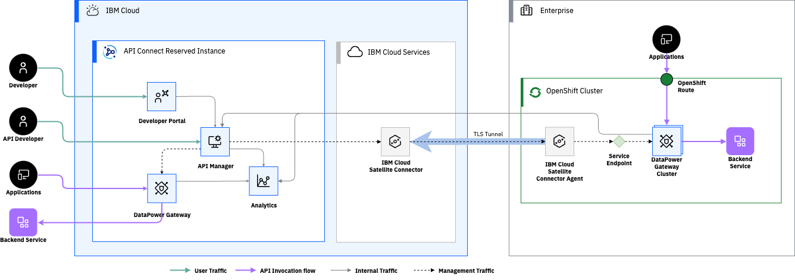

This post should guide you through the steps on how to deploy a datapower gateway to use as a remote gateway with API Connect Reserved instance, optionally configuring the inbound management traffic through IBM Cloud Satellite Connector.

<!--more-->

## Installing the Operators

To install the operators in your cluster, the steps are as described in the documentation on how to [install the operators](https://www.ibm.com/docs/en/api-connect/10.0.8?topic=openshift-installing-operators)

## Set up certificates

Again follow the [steps for creating certificates](https://www.ibm.com/docs/en/api-connect/10.0.8?topic=openshift-setting-up-certificate-issuer) in the documentation.

## Deploy the Gateway Cluster

Deploying the gateway cluster into Openshift is just a case of creating the GatewayCluster CR - you can start from [this template](gateway.template.yaml).

- Create a pull-secret with access to download the datapower images and reference it under imagePullSecrets. You can download the image to mirror to your registry from the 'Download Gateway' button in the reserved instance Config Manager.
- Create a secret containing the password for the datapower admin user and ensure it is referenced under `adminUser` - you can use the following command to create this:
  
    oc create secret generic admin-secret --from-literal=password={SET-PASSWORD-HERE!}

- Update `imageRegistry` to point to your image registry.
- Update the `jwksUrl` for your reserved instance, this needs to be the platform api endpoint for the reserved instance followed by `/api/cloud/oauth2/certs` - you can find the platform api endpoint url from the 'Download Clients' link in the API Manager interface.
- Select and configure the [appropriate profile](https://www.ibm.com/docs/en/api-connect/10.0.8?topic=licensing-datapower-gateway-deployment-profile-limits) for your cluster.
- Create a secret with the CA the reserved instance endpoints are signed by - Let's Encrypt X2 Root CA ([Download from the Let's Encrypt site](https://letsencrypt.org/certs/isrg-root-x2.pem)) and ensure the `secretName` for `mgmtPlatformEndpointCASecret` points to this.

    curl https://letsencrypt.org/certs/isrg-root-x2.pem -o isrg-root-x2.pem
    oc create secret generic isrg-root-x2 --from-file=ca.crt=isrg-root-x2.pem

- [Optional] If you are routing the inbound traffic through IBM Cloud Satellite Connector, you will need to configure the hostname for the `gatewayManagerEndpoint` to match the private cloud endpoint hostname for your connector - typically `c-01.private.{region}.link.satellite.cloud.ibm.com`.
- Apply the gateway cluster yaml
- You can check the status of the cluster using `oc get gatewaycluster`. If you see any issues you can use `oc describe gatewaycluster` for more details.

## Set up Satellite Connector [optional]

Optionally, deploy a satellite connector agent on the same cluster as the remote gateway

- [Create a Satellite Connector](https://cloud.ibm.com/docs/satellite?topic=satellite-create-connector&interface=ui)
- [Deploy the agent](https://cloud.ibm.com/docs/satellite?topic=satellite-run-agent-locally&interface=ui)
- Create a Connector Endpoint for the gateway management interface [docs](https://cloud.ibm.com/docs/satellite?topic=satellite-connector-create-endpoints&interface=ui).  For the Gateway management endpoint you will need the following details:
  - Destination FQDN: `{gateway-cluster-name}-datapower.{namespace}.svc` e.g. `api-gateway-datapower.apicri-gateway.svc`
  - Destination Port: 3000
  - TCP

## Register gateway with Reserved Instance

Create TLS Client Profile so that the manager can trust the CA that signs the certificate for the gateway management endpoint.  This can be done through the RI Config manager under TLS.

- Create a Trust Store containing the CA Certificate which can be obtained by copying out the ca.crt from the `gateway-manager-endpoint-secret` and putting it in a file named ca.pem (API Connect needs the .pem extension for the upload to be accepted.)
- Create TLS Client Profile referencing the Trust store created

Create TLS Server profiles to present to clients invoking the APIs:

- Create TLS Key Store containing the certificate and private key to present - typically these would be obtained through an external Certificate Authority. 
- Create a Server profile referencing the key store created.

To register the gateway on the 'Gateways' tab you will need the following details:

- URL of management endpoint: If using Satellite, this is the link endpoint URL including the port number.  If not, this will be the hostname from the gatewayManagerEndpoint in the gateway cluster CR.
- TLS Client Profile: profile created above
- Base URL of API Invocation endpoint:  The host from the gatewayEndpoint in the CR that inbound clients will use
  - TLS Server Profile: profile created above
