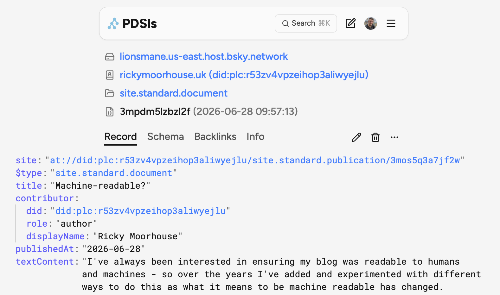
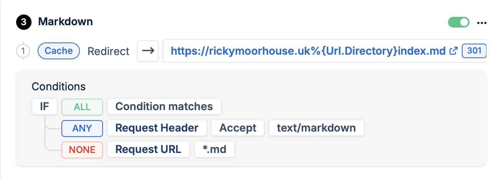

I've always been interested in ensuring my blog was readable to humans and machines - so over the years I've added and experimented with different ways to do this as what it means to be machine readable has changed. I currently have a range of these supported from embedded metadata to alternate versions that can be used with an LLM. Currently on this blog I am using the following:

- [RSS](https://www.rssboard.org/rss-specification) Feed - [my RSS feed](/feed)
- [JSON Feed](https://www.jsonfeed.org) ([validator](https://validator.jsonfeed.org))- [my json feed](/jsonfeed)
- [hentry](microformats.org/wiki/h-entry) ([validator](https://indiewebify.me/validate-h-entry/))
- [TechArticle](https://schema.org/TechArticle) ([validator](https://validator.schema.org))
- [OpenGraph](https://ogp.me)  ([validator](https://opengraph.dev))
- Alternate markdown version - [this page in markdown](../machine-readability/index.md)
- [standard.site](https://standard.site) ([validator](https://site-validator.fly.dev/))

As I recently added the alternate markdown version and the standard.site integration here's some details on how:

## Adding standard.site to my hugo static blog

Initially I started using [Sequoia](https://sequoia.pub/) which is a great tool that can handle processing and posting documents from a static site and whilst it did a great job of processing and posting my content, I wanted a bit more control.  In particular the way I handle featured images didn't fit with its model and I didn't want to inject links into the generated html - I wanted this as part of the main templates. Adding the [meta tags](https://github.com/rickymoorhouse/blog/blob/bb1f993d07cddc80ec0d344848fe46e90d057ee4/themes/2026/layouts/_partials/header.html#L13-L16) to the template was straight forward - always including the publication reference and the document one where specified in the frontmatter.  

Now the next thing to do was to find a new way to post the documents and obtain the `did` for the standard.site document. I came across this [useful guide](https://piccalil.li/blog/publishing-on-the-atmosphere-with-standardsite/) which gave me some good pointers on the basics through nodejs examples, but as I prefer to write scripts in python, I ported the ideas into my own script. Whilst building this I used [pds.ls](https://pds.ls) to check on the [results](https://pds.ls/at://did:plc:r53zv4vpzeihop3aliwyejlu/site.standard.document/3mpdm5lzbzl2f).



You can see my [current script in github](https://github.com/rickymoorhouse/blog/blob/main/scripts/atmosphere.py) - this will either take in an md file as a parameter or identify one from the staged commit. The script then builds the standard.site.document lexicon content:

```python
document_record = {
    '$type': 'site.standard.document',
    'site': blog_did,
    'title': post_data['frontmatter'].get('title', 'Untitled'),
    'publishedAt': post_data['frontmatter'].get('date'),
    'textContent': text_content,
    'canonicalUrl': post_url,
    'contributor': {   
        'did': agent.me.did,
        'role': 'author',
        'displayName': "Ricky Moorhouse",
    }
}
# If there is a featured image, upload as blob and get the reference
if 'featured' in post_data['frontmatter']:
    featured_image = post_data['frontmatter']['featured']

    # get relative path to the post file, removing the file name
    post_path = post.rsplit('/', 1)[0]

    # Upload to atmosphere and get the blob reference
    blob_ref = upload_featured_image(agent, post_path, featured_image)
    document_record['cover'] = blob_ref
```

If I have an atUri already in the front-matter, the existing document is updated, otherwise a new one is published and adds the atUri to the front-matter. At the moment my workflow is to write the post, stage the commit and then run the script before updating the commit and pushing to GitHub where my actions will then publish the blog post, but eventually I plan to move the script to be run from the actions as part of the publishing. I'm also experimenting with using an LLM to generate a post for social media to link to the article.


## Markdown versions of posts

As well as extending to push documents to atproto using the standard.site lexicon I've added markdown files for easier consumption by AI Agents - inspired by [isitagentready](https://isitagentready.com/). These files are generated through hugo as part of the publishing flow.

To add markdown versions of posts, I just added markdown as an output format, created .md versions of my page and home template and included metadata pointing to the `alternate` version in the header - you can see how in this [commit](https://github.com/rickymoorhouse/blog/commit/f09280ff7edee0bedf90ee09cd489d6c2852cc89).

Once the files were being generated, I added a Bunny CDN Edge rule to handle content negotiation so that if content type of `text/markdown` is requested, then I redirect to the md file. This way the same URL can be used for reference and humans and agents will each get the most appropriate version.

