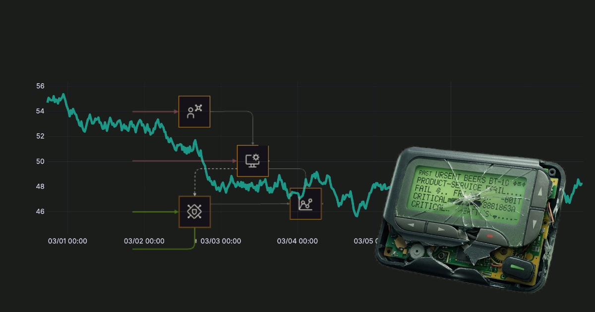

I spent a good chunk of my career working in SRE and then when the opportunity came up I took the decision to move over into an Architecture role - in some ways a change and in many ways a wider remit to continue with the types of things I'd been doing and working on in the SRE team.  

## How SRE reliability principles shape architecture

Core principles from my time in SRE have definitely shaped the way I look at bringing our product to the cloud - and whilst there's still a lot of things that I (and our SRE team) wish we had done better with, I think it's a valuable insight to have when building out these systems. I think the biggest area this has influenced my way of working is a desire to be driven by real data where possible and validate my thinking with what we are seeing in reality. 

## Sizing - planning for reality, not hopes

When we're building something new we often get the numbers wrong - either we're too optimistic and expect viral exponential growth or we're too pessimistic and assume no-one is interested. If however you're building something that you have experience with either directly or in a similar area there is real data available to reference. 

This means you can inform your sizing estimations with a grounding in historic real world usage data.  It won't always be precise and these things usually don't repeat in the same way but at least it means you are learning from something and building on the lived experience. 

Even though we can capture some data to base our sizing on we still want to validate it -  key to any architecture is testing the decisions you've made - both in small parts and end to end.  For load testing I would want to use realistic numbers that can be proportioned against the expectations - so validating each point in the scale up - over a short term to understand the characteristics - then do some additional longer running load tests to ensure things continue to operate over time as you would expect.  This also needs to be combined with your observability plan - if you get these in place early you can use them as part of your load testing validation and capture valuable insights into your system. 

This then leads into the next set of sizing decisions - how and when do you scale? For each part of your system you need to look at how scaling would apply and the impact this has on the neighbouring components - e.g. if we just scale up the API Gateway to handle more load but haven't ensured we have the right rate limiting or considered the capacity of the backend microservices serving the API we could just be opening ourselves up for too much traffic and different types of failure. At each layer we need to consider how much capacity we need, how long the different scaling strategies would take and the cost implications of allowing this to scale automatically.  Some parts of the system may be so critical or growth is directly proportional to your revenue so that an increase in cost with autoscaling may be the desired outcome. 

## Observability - you can't fix what you can't see

Can you tell what is going on in the system? As systems become more complex and more microservices are added it is fundamental to be able to answer these types of questions about specific areas.  Building systems for observability from the start makes it a lot easier than bolting this on afterwards.  Defining standard approaches and formats for observability means that you're not deciding for each component independently but you have something that everything in the system can adopt.  These need to cover the three main pillars of observability - Metrics, Logs and Traces.

- **Metrics** give you a lightweight numeric representation of parts of your system that you can graph over time - they are useful for indicators as to how loaded things are or how slow certain flows are performing.  For example, response times, payload sizes and error count
- **Traces** let you follow the end to end journey of a request through your system detailing the steps it has taken along the way and connections between microservices and processes. This would show the inbound request from when it hits your API Gateway on to each microservice that is involved in responding to that request - giving you full details of what and when at each stage. In fact your traces are really the living illustration of your architecture. 
- **Logs** give you insight into the path through your code that is being taken or the error cases you are hitting. Having consistently formatted structured logs with request ids to correlate what request the log relates to or tie it to the trace without guessing.  
 
I read a comment somewhere that diagnosing problems in a microservices architecture is like a murder mystery - however much you like solving these, you don't want to have to at 3am at the end of a pager, so in logging we need to think about this up front. 

Metrics will give you an easy snapshot of if there is a problem, Traces will show you which service is causing the problem and the logs will tell you why.  These will also have a significant impact on the costing of your solution - metrics being the cheapest and logs being the most expensive as they will scale up rapidly as your volumes increase - 1 transaction could result in 10-100 log lines depending on the complexity and how verbose your logging is.  This is also why it is key to be able to dynamically adjust log levels - you can keep the general volume down and increase it as necessary. 

As with sizing we mustn't get carried away with the trillions of transactions we're hoping to see on day 1 with 100% uptime - we need to set some expectations (Service Level Objectives) as to what real use of the system needs to look like and what our customers would accept.  NB. This is not what the SLA is or what the ideal requirement is (that would be super fast and always available) but the acceptable level of availability and responsiveness day to day. In some scenarios waiting for 5 seconds for data is fine, and others it is needed within milliseconds and each delay costs money. Just like some scenarios can cope with a retry and others can't. 

Sizing the system, ensuring we can answer the crucial questions about what is happening in it and appropriately meet our users' expectations are some of the ways my SRE experience has directly fed into my architecture work.  One of the next topics I plan to explore here is failure modes building from what I've covered here. 