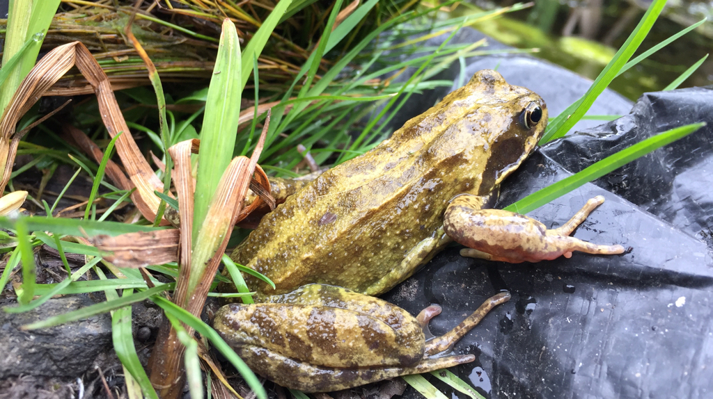
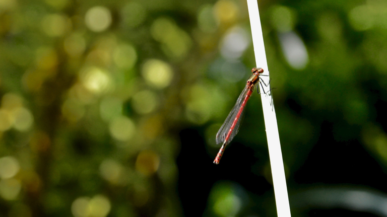

# Pond visitors

This lovely frog actually visited the front garden first and was found by Laura whilst she was clearing the flower beds and we took the frog round to the back in a large plant pot. On seeing the pond, the frog sat for a couple of minutes and then dived straight in.

On the bank holiday Monday, this damsel fly kept visiting the pond and siting enjoying the sun
