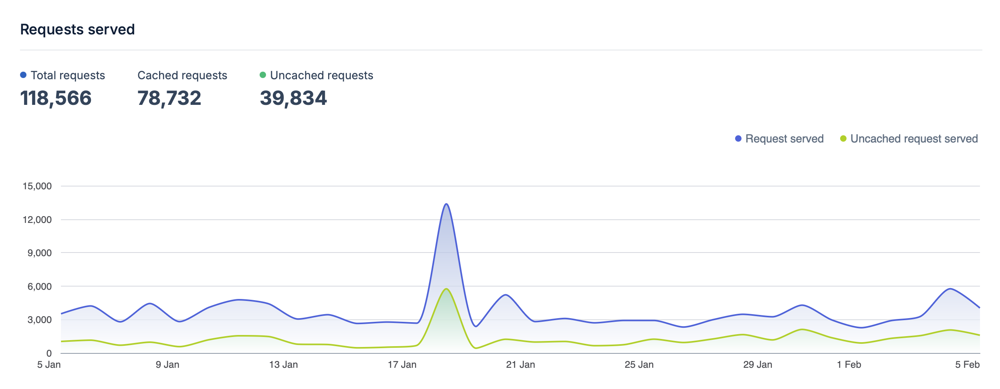

My site is powered by Hugo and lives on GitHub. I use GitHub Actions to build and deploy the site to BunnyCDN.

# Hugo

After previously using a self-built blogging engine and then Wordpress for a while, I decided that I didn't want to deal with running a database backed dynamic site any longer and that a static file based site would both perform better and be simpler to keep running.  I looked at a number of different static site generators and played with [Jekyll](https://jekyllrb.com) and [Pelican](http://getpelican.com) but in the end decided on [Hugo](https://gohugo.io). This was primarily as I have been moving more to building things in Go and the templating system and site structure felt like a good fit for my needs.

The search on the site is powered by [pagefind]() - which still could do with some fine tuning and aligning the styles but it mostly works nicely for now. 

## Bunny CDN

I've been through a number of places the static site lived - from several VPS providers to an S3 bucket fronted by Cloudfront, then when I was reading about some European hosting options I came across [Bunny](https://bunny.net) and decided to try their CDN as an option. It seemed to perform well - easy to update and good response times.

I have a storage zone in London with a replica in Brazil and a Pull Zone configured with Europe and North America zones configured.  I don't remember why I chose Brazil for the storage replica!  I generally see a good level of cache hits in the stats they provide.



## Github Actions CI/CD 

The site is automatically deployed when I push to the main branch in it's [github repo](https://github.com/rickymoorhouse/blog) which makes it easier to tweak or add to without needing to be at a computer.

I have a couple of shortcuts configured on my phone so I can easily post [Photos](/photos) and [Locations](/travel) whilst I'm away from home which use [Working Copy](https://workingcopy.app) to push to github. Occasionally I will also use working copy or the GitHub mobile app to edit more but usually it's from the shortcuts.

## Travel map

Updated a bit from the original [Places visited map](/blog/2018/places-visited-map/) which worked from front-matter, I've since moved to a separate data folder of locations to show on the map as yaml files containing the location, name, some additional metadata and an optionally a link and photo to include.  This looks something like:

```yaml
title: "San Jose"
layout: travel
datePosted: 2022
photo: /travel/photos/sanjose.jpg
lat: 9.9332828
lng: -84.0776586
description: >
    # Hotel Presidente, San Jose
    
Year: 2022
```

I'm not using all of this yet but wanted to include some additional elements for the future. This is then processed into GeoJSON in a [layout template](https://github.com/rickymoorhouse/blog/blob/main/layouts/geojson.json?short_path=b97ff09). The map itself is still powered by [Mapbox GL](https://docs.mapbox.com/mapbox-gl-js/guides/) using the [map display template](https://github.com/rickymoorhouse/blog/blob/main/layouts/map.html).

## Recent Changes

- Added `tagged-posts` shortcode to list blog entries with a given tag using `short-list-item` partial
- Added theme switching support to MapBox maps
- Built flights.json generation system with Python script, integrated into GitHub Actions
- Added projects section with styling improvements
- Added microblog section with a bot to post from Telegram 